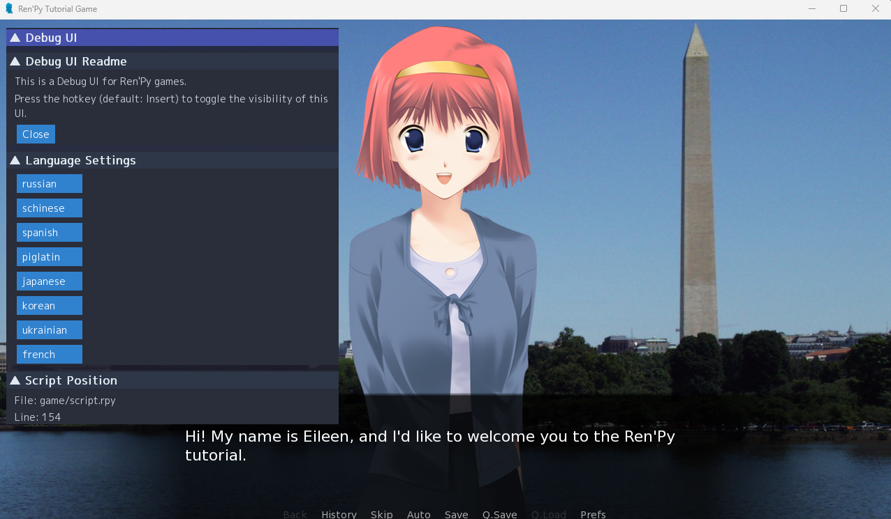

# Ren'Py Debug UI

Ren'Py Debug UI は、Ren'Py のデバッグや開発を支援するためのツールとして、現在開発中です。

[日本語](README.ja.md) | [English](README.md)

## 特徴

- [x] 言語の高速切り替え
- [x] 現在表示されているセリフや選択肢のファイルと行番号の表示
- [x] 変数エクスプローラー

## 導入方法

1. このリポジトリをクローンまたはダウンロード
2. Ren'Py プロジェクトの`game`フォルダ直下に`renpy_debug_ui`フォルダをコピー
3. これだけで導入完了！

## 使用方法

- InsertキーでデバッグUIの表示/非表示を切り替え

## 対応バージョン

このツールは主にRen'Py 8.0以降のバージョンに向けて開発されています。  
Ren'Py 6.99.11以上であれば今のところ動作しますが、このツールの開発が進み互換がなくなり動作しなくなる可能性があります。あらかじめご了承ください。

なお、Ren'Py 6.99.11以前のバージョンはGUIのAPIが大きく異なるため、これらのサポートは行いません。

## 使用フォント・ライセンス

このリポジトリには [M PLUS 1p Regular](https://fonts.google.com/specimen/M+PLUS+1p) フォントが含まれています。

- フォント名: M PLUS 1p Regular
- ライセンス: SIL Open Font License 1.1
- 著作権者: M+ Fonts Project

フォントのライセンス全文は [OFL.txt](OFL.txt) に同梱しています。  
また、[SIL Open Font License 1.1](https://scripts.sil.org/OFL) もご参照ください。

コード自体のライセンスは[MIT License](LICENSE)となっています。
